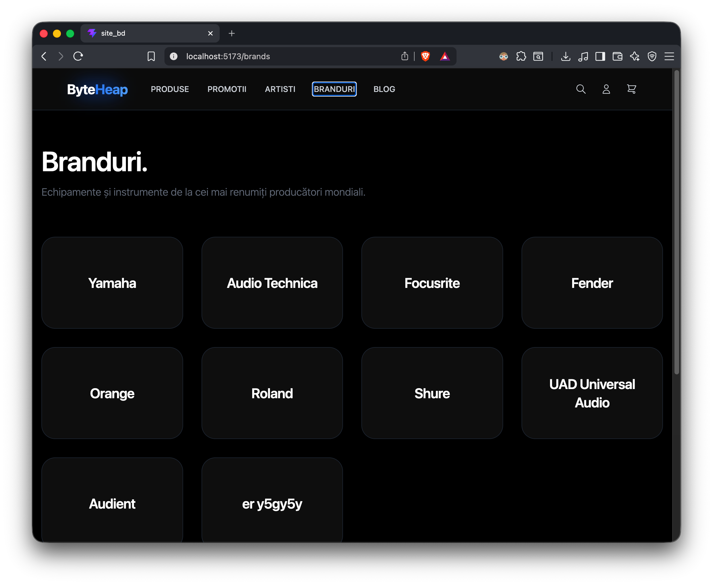
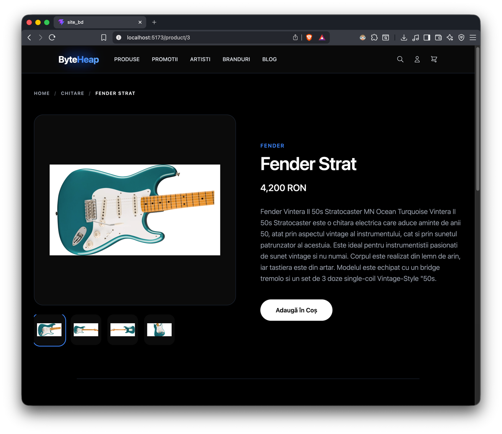
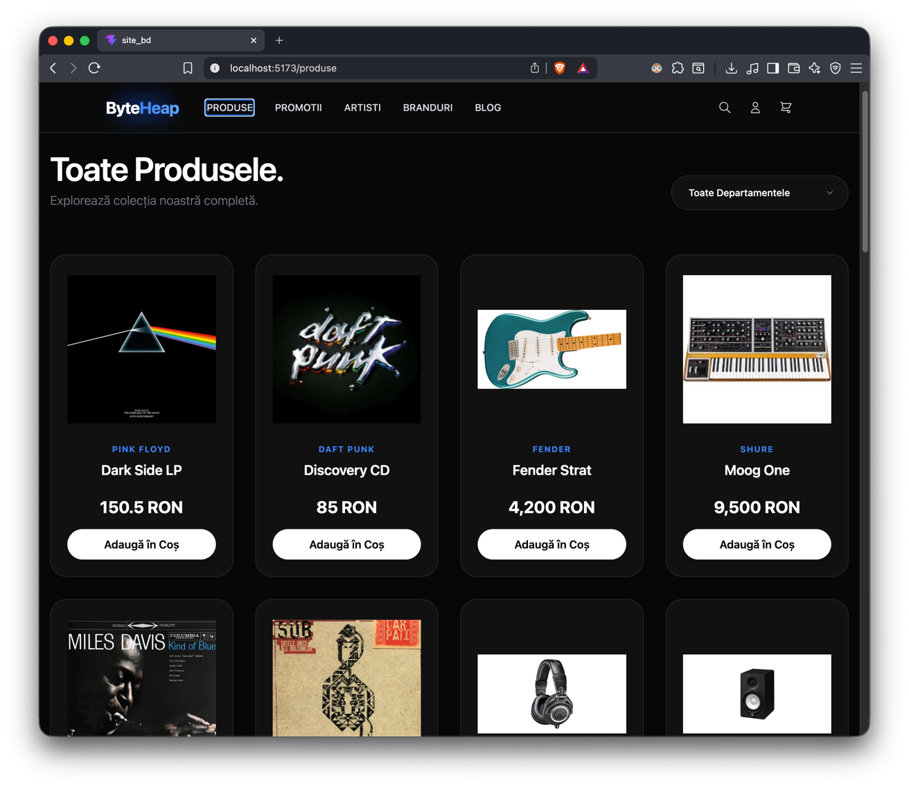
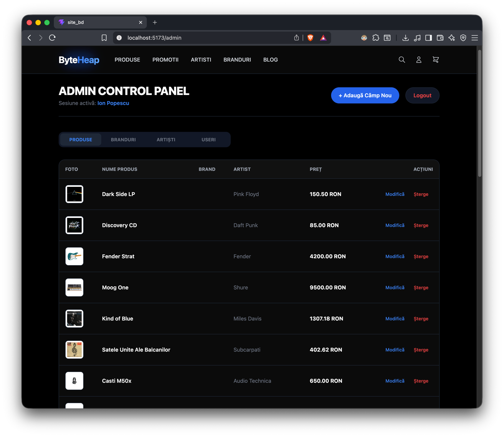

# BYTEHEAP MUSIC STORE PLATFORM


This file contains the complete source code, architectural specifications, and setup configurations for the complete ByteHeap MUSIC store. All components have been redesigned to follow the minimal layout framework.

---

##  TABLE OF CONTENTS

1. [Architectural Overview & Live Sync Configuration](#1-architectural-overview--live-sync-configuration)
2. [Backend API Router (`server.js`)](#2-backend-api-router-serverjs)
3. [Backend Routing & Layout Configuration](#3-backend-routing--layout-configuration-apptsx--headertsx)
4. [Full Client Frontend Source Codes (Apple Style Pages)](#4-full-client-frontend-source-codes-apple-style-pages)
5. [Administrative Control Console (`AdminDashboard.tsx`)](#5-administrative-control-console-admindashboardtsx)

---


## 1. ARCHITECTURAL OVERVIEW & LIVE SYNC CONFIGURATION

### Data Architecture
The platform relies on a seamless connection between the active Node.js backend (`server.js`) and the MySQL database instantiated by script (`script10.mysql`). The SQL script provisions the foundational relational schema (the `music_store` database and its tables). Then, `server.js` acts as the operational bridge, utilizing the `mysql2` driver to establish a persistent connection (via `root`@`localhost`) that maps incoming RESTful API HTTP requests directly to SQL CRUD executions.

### How to Run
* **Vite Local Server Dev Host:** Forward port `5173` (Run via `npm run dev -- --host`)
* **REST Server API Routing Instance:** Forward port `5001` (Run via `node server.js`)
* **Relational Database Management Hub:** Forward port `3306` (Allows your partner to connect their WebStorm Database window directly using `host: localhost`, `port: 3306`, `user: root`)

---

## 2. BACKEND API ROUTER (`server.js`)

```javascript
const express = require('express');
const mysql = require('mysql2');
const cors = require('cors');

const app = express();

// 1. CORS at the absolute top (allows Vite to connect)
app.use(cors({ origin: '*' }));

// 2. JSON Parser
app.use(express.json());

// 3. Database Connection
const db = mysql.createConnection({
    host: 'localhost',
    user: 'root',
    password: '',
    database: 'music_store'
});

db.connect((err) => {
    if (err) {
        console.error('Error connecting to MySQL:', err);
        return;
    }
    console.log('Connected to MySQL Database!');
});

// GET: Toate produsele
app.get('/api/products', (req, res) => {
    const query = `
        SELECT p.*, c.numeCategorie, a.numeArtist, b.numeBrand
        FROM tblProduse p
                 LEFT JOIN tblCategorii c ON p.codCategorie = c.idCategorie
                 LEFT JOIN tblArtisti a ON p.codArtist = a.idArtist
                 LEFT JOIN tblBranduri b ON p.codBrand = b.idBrand
    `;
    db.query(query, (err, results) => {
        if (err) return res.status(500).json({ error: err.message });

        const products = results.map(row => ({
            id: row.idProdus,
            name: row.numeProdus,
            price: row.pretProdus,
            currency: 'RON',
            image: row.imagineProdus || 'https://via.placeholder.com/300',
            category: row.numeCategorie || 'Uncategorized',
            brand: row.numeBrand || row.numeArtist || 'Generic',
            brandId: row.codBrand,
            codCategorie: row.codCategorie,
            codArtist: row.codArtist,
            codBrand: row.codBrand,
            description: row.descriereProdus || 'No description available.',
            specs: typeof row.specificatii === 'string'
                ? JSON.parse(row.specificatii)
                : (row.specificatii || {}),
            gallery: typeof row.galerie === 'string'
                ? JSON.parse(row.galerie)
                : (row.galerie || [])
        }));
        res.json(products);
    });
});

// ... (Other routes omitted for brevity in this preview, refer to original server.js for full CRUD) ...

const PORT = 5001;
app.listen(PORT, () => console.log(`Backend Server running on http://localhost:${PORT}`));
```

---

## 3. BACKEND ROUTING & LAYOUT CONFIGURATION (`App.tsx` & `Header.tsx`)

### `App.tsx`
```tsx
import { BrowserRouter, Routes, Route } from 'react-router-dom';
import MainLayout from './layouts/MainLayout';
import HomePage from './pages/HomePage';
import ProductPage from './pages/ProductPage';
import ArtistsPage from './pages/ArtistsPage';
import ArtistDetail from './pages/ArtistDetail';
import CategoryPage from './pages/CategoryPage';
import BrandPage from './pages/BrandPage';
import BrandDetail from "./pages/BrandDetail.tsx";
import CartPage from './pages/CartPage';
import RegisterPage from './pages/RegisterPage';
import UserPage from './pages/UserPage';
import LoginPage from './pages/LoginPage';
import AdminDashboard from './pages/AdminDashboard';
import { CartProvider } from './context/CartContext';
import { AuthProvider } from './context/AuthContext';
import PromotionsPage from './pages/PromotionsPage';

function App() {
    return (
        <AuthProvider>
            <CartProvider>
                <BrowserRouter>
                    <Routes>
                        <Route element={<MainLayout />}>
                            <Route path="/" element={<HomePage />} />
                            <Route path="/product/:id" element={<ProductPage />} />
                            <Route path="/artists" element={<ArtistsPage />} />
                            <Route path="/artist/:id" element={<ArtistDetail />} />
                            <Route path="/category/:id" element={<CategoryPage />} />
                            <Route path="/brands" element={<BrandPage />} />
                            <Route path="/brand/:id" element={<BrandDetail />} />
                            <Route path="/cart" element={<CartPage />} />
                            <Route path="/produse" element={<CategoryPage />} />
                            <Route path="/promotii" element={<PromotionsPage />} />
                            <Route path="/login" element={<LoginPage />} />
                            <Route path="/register" element={<RegisterPage />} />
                            <Route path="/profile" element={<UserPage />} />
                            <Route path="/admin" element={<AdminDashboard />} />
                        </Route>
                    </Routes>
                </BrowserRouter>
            </CartProvider>
        </AuthProvider>
    );
}
export default App;
```

---

## 4. FULL CLIENT FRONTEND SOURCE CODES  (`CategoryPage.tsx`, `BrandsPage.tsx`,`ArtistsPage.tsx`, `ProductPage.tsx`)

<div style="display: flex; justify-content: center;">
    
</div>
<div style="display: flex; justify-content: center;">
    
</div>

<div style="display: flex; justify-content: center;">
    
</div>
<div style="display: flex; justify-content: center;">
    
</div>

---
## 5. ADMINISTRATIVE CONTROL CONSOLE (`AdminDashboard.tsx`)

<div style="display: flex; justify-content: center;">
    
</div>
